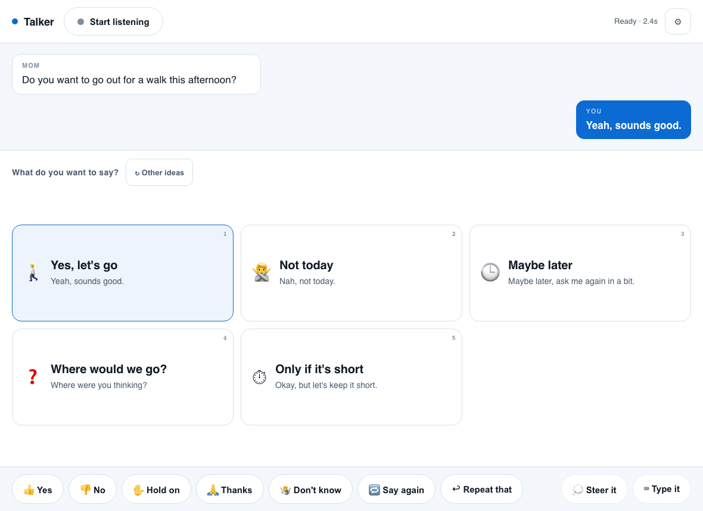
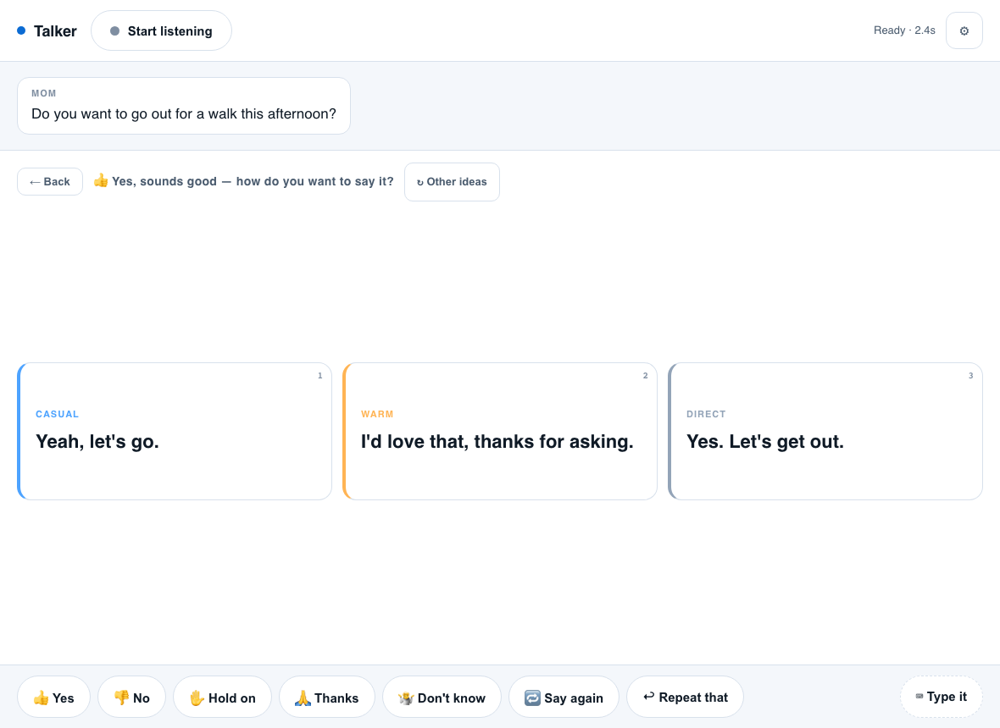

# Talker

An AAC conversation assistant. It listens to the person you're talking with,
suggests what you might want to say back, and speaks your choice aloud.

Built for someone who understands every word of a conversation and knows exactly
what he wants to say — but for whom spelling that out letter by letter takes long
enough that the moment passes. Talker's job is to put the sentence he was already
reaching for within two taps.



## How it works

Two taps, and they are deliberately different questions.

**Tap 1 — what do you mean?** Five tiles, each a different conversational move:
agree, decline, ask something back, change the subject, stall. Not five shades of
"yes."

**Tap 2 — how do you want to say it?** The same meaning in three tones, so the
words sound like him and not like a machine being polite.



Splitting the choice this way keeps each decision small. Picking from fifteen
sentences at once is slower than picking a meaning and then a tone, and it's the
tone that makes a suggestion feel like your own words rather than someone else's.

## Design decisions worth knowing about

**Never invent a fact about his life.** The single most important rule in the
prompt. If the app suggests "I had a rough night" and he taps it because it was
closest, it has made him lie — and he may not be able to correct it. Suggestions
are built from conversational moves and from things actually said in the
conversation or recorded in his profile. Where a detail is missing, the sentence
is written so he can supply it: "Not great, actually" rather than a specific claim.

**Latency is the product.** A suggestion that arrives after the moment has passed
is worth nothing. Three things are doing work here:

- The tile labels and the full sentences are two separate arrays in the response
  schema, not nested. Structured outputs generate in schema order, so all five
  labels land in about a second while the fifteen sentences are still being
  written. Nesting them — the obvious shape — meant nothing appeared for four.
- Both are streamed to the browser over SSE and rendered as they arrive.
- The tone variants are generated in the *same* call as the intents, so tap 2 is
  instant. No second round trip.

Measured on `claude-opus-5` at low effort: **~2.5s to the first tile, ~3.5s to all
five**, of which roughly two seconds is time-to-first-token.

**Nothing important moves.** Tiles fill in place as they stream, and the row keeps
its height, so the layout never reflows under a finger already on its way down.

**Always an escape hatch.** The suggestions will sometimes miss. Quick phrases
(Yes / No / Hold on / Say again) are always on screen and never touch the network,
and "⌨ Type it" is always one tap away. If the API is down, those still work.
"💭 Steer it" takes a few words about what he wants to talk about and builds the
five tiles around that instead — the suggestions follow the other person's lead by
default, and this is how he takes it back.

**Misheard lines can be deleted.** Recognition errors don't just sit in the
transcript, they get fed into every following suggestion. Hovering a heard line
shows a × that removes it.

**Emotional range on purpose.** A suggestion set where every option is pleasant
can't express how he actually feels. Being annoyed, bored, or done talking are
offered as readily as agreement.

**Always something to ask back.** At least one of the five tiles is a question for
the other person. AAC users get stuck being interviewed — everyone asks them
questions, they answer, repeat. Handing him a question to ask is what turns being
talked at into a conversation.

## Memory

Three layers, because they fail differently.

**Tone preference** is learned locally from which variants he taps. No tokens, no
model call. After a few dozen taps it's a better signal about how he likes to sound
than anything inferred from a transcript.

**Recent events** are dated specifics — *"Watched the new Spider-Man; thought it was
much better than the last one."* They expire after three weeks. This is what lets him
pick a thread back up the next day instead of re-spelling something he already said.

**Standing facts** — people, topics, notes, phrases — are the durable layer, and the
reflection prompt is told to be conservative about them, because a wrong standing fact
gets injected into every future suggestion forever.

The split between the last two matters more than it looks. An earlier version had only
the durable layer, and the prompt's instruction to ignore "the content of one
conversation" meant that when he said *"I watched the new Spider-Man, it was much
better than the last one,"* the profile recorded `topic: films` and threw the rest
away. The next day, asked "seen anything good lately?", the best tile it could offer
was **"Saw a superhero movie."** He'd have had to spell out *Spider-Man* by hand —
exactly the thing this app exists to prevent. With the episodic layer, the same
question now produces **"Yeah, saw the new Spider-Man last night. Loved it."**

The underlying mistake was applying the no-fabrication rule to the wrong thing.
Suggestions must never invent facts about his life — but a sentence *he* chose and
spoke through the app is verified ground truth, and the safest possible material to
remember. The reflection prompt now distinguishes the two explicitly.

Reflection runs after a 90-second lull in conversation, not on page close. An AAC
tablet stays open all day, and `beforeunload` is unreliable exactly when it matters —
a sleeping device would silently lose everything he'd said.

Everything lives in `data/memory.json`, is editable from the settings panel, and is
re-read when the file changes on disk. Seeding it by hand before a real session makes
a visible difference: a one-line note ("dislikes being asked how he is feeling
repeatedly") produced a "Stop asking that" tile worded *"Same as the last five times
you asked."*

## Running it

```bash
npm install
cp .env.example .env      # add your ANTHROPIC_API_KEY
npm start                 # http://localhost:3000
```

Chrome or Edge — speech recognition is a Chromium feature. Microphone access
needs `localhost` or HTTPS.

### Keyboard and switch access

Everything is reachable without a pointer, which also makes it drivable by a
switch interface or an on-screen keyboard:

| Key | Action |
|---|---|
| `Space` | Start / stop listening |
| `1`–`5` | Pick a tile (meaning, then tone) |
| `Esc` / `Backspace` | Back to the meanings |
| `r` | New suggestions for the same moment |

## Choosing a model

`TALKER_MODEL` in `.env`. Measured on the same turn, two runs each:

| Model | First tile | All five | Cost / turn |
|---|---|---|---|
| `claude-opus-5` (default) | 3.4s | 4.1s | $0.015 |
| `claude-sonnet-5` | **1.9s** | 3.1s | $0.013 |
| `claude-haiku-4-5` | — | — | $0.003 |

Sonnet 5 was about 45% faster to the first tile with suggestion quality that
looked comparable on these scenarios, and in a live conversation that difference
is felt. It's a reasonable switch to make. Run `npm run compare` to re-measure on
your own scenarios before deciding — and judge the output, not just the clock.

Effort is set to `low` and thinking is off: this is a fast structured-generation
task, and both cost latency without improving the suggestions.

## Testing

```bash
npm test        # unit tests, no API calls
npm run smoke   # three real scenarios, prints suggestions + latency + cost
npm run ui      # drives the real UI in headless Chromium, writes screenshots
npm run compare # latency/cost/quality across models
```

`npm run smoke` is the one to run after changing a prompt. It prints what the
model actually suggests for an ordinary question, a piece of bad news, and a
mid-conversation moment — read the suggestions, not just the timings. The bad-news
scenario is there specifically to check that the tone selection stays appropriate;
if "funny" ever shows up in it, the prompt has regressed.

Cost is tracked locally and exposed at `/api/usage`.

## Status

Working prototype. What it does not yet have:

- **No real-user testing.** Everything here is a guess about what helps until he
  has used it. The intent categories and the tone set are the first things that
  should change based on what he actually reaches for, and the tone names
  (`casual`, `warm`, `firm`…) are placeholders until he says what fits.
- Nothing handles the microphone picking up a third person in the room —
  everything heard is attributed to one conversation partner.
- A misheard line can be deleted but not edited, so a mostly-right transcription
  has to be thrown away rather than fixed.
- Memory has no undo — a bad fact has to be edited out by hand in settings, and
  nothing surfaces *what changed* after a reflection pass, so a wrong entry can sit
  there unnoticed while it shapes suggestions.
- Recent events expire on a fixed 21-day timer, which is wrong in both directions: a
  hospital appointment matters longer than that, a passing comment matters for a day.
- Group conversations, phone calls, and anything that isn't two people in a room
  are out of scope so far.
